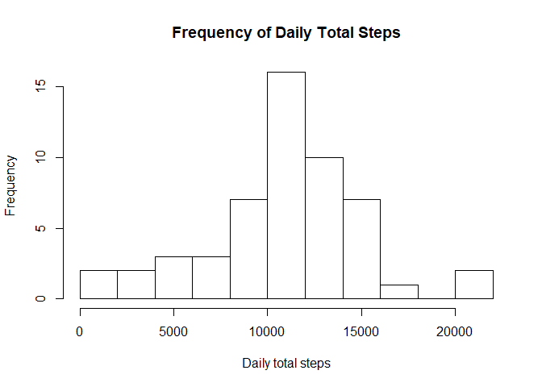
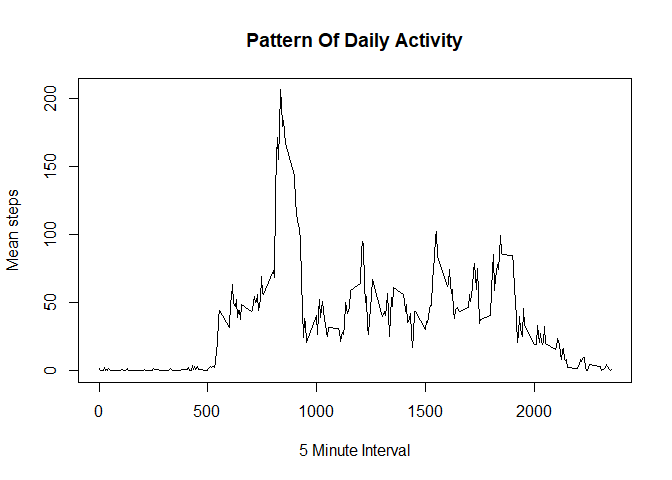
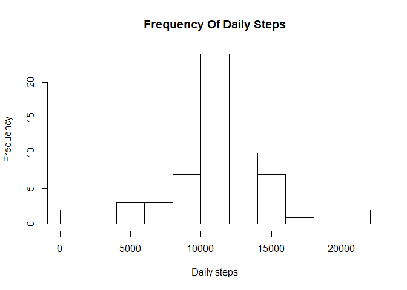
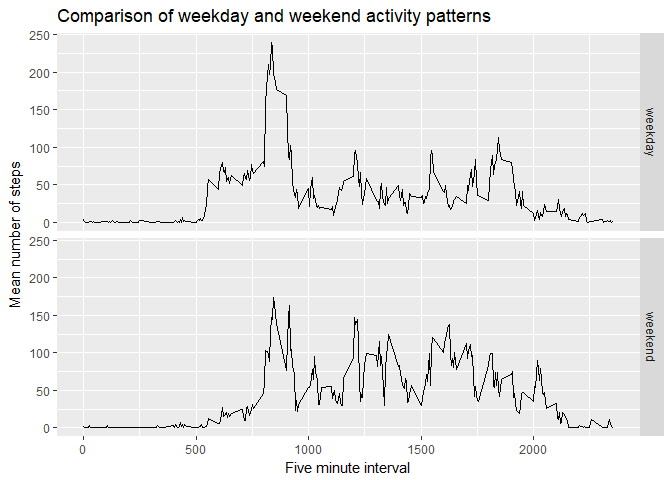

## Loading and preprocessing the data

The code below downloads and reads the data. It also does some very basic processing to ensure the dates are set as date data type. We also load the dplyr, chron and ggplot2 libraries, which will be used later.


```r
knitr::opts_chunk$set(echo = TRUE, cache=TRUE)
options(scipen = 999)
library(dplyr)
```

```
## 
## Attaching package: 'dplyr'
```

```
## The following objects are masked from 'package:stats':
## 
##     filter, lag
```

```
## The following objects are masked from 'package:base':
## 
##     intersect, setdiff, setequal, union
```

```r
library(chron)
library(ggplot2)
fileURL <- "https://d396qusza40orc.cloudfront.net/repdata%2Fdata%2Factivity.zip"
localFileName <- "activity.zip"
download.file(fileURL, localFileName)
unzip(zipfile = localFileName)
activityData <- read.csv("activity.csv")

activityData$date <- as.Date(activityData$date)
```


## What is mean total number of steps taken per day?

The following code groups the activity data by date, then sums the total number of steps for each day (using the summarise function).
We then create a histogram to show the frequency of total daily steps.


```r
dailySummary <- activityData %>%
    group_by(date) %>%
    summarise(dailyTotalSteps=sum(steps))

hist(dailySummary$dailyTotalSteps, breaks = 10, main = "Frequency of Daily Total Steps" , xlab = "Daily total steps")
```

<!-- -->

```r
meanStepsPerDay <- mean(dailySummary$dailyTotalSteps, na.rm = TRUE)

medianStepsPerDay <- median(dailySummary$dailyTotalSteps, na.rm = TRUE)
```

Mean total number of steps per days: 10766.1886792.  
Median total number of steps per day: 10765.  
We can see that this appears consistent with the histogram above.

## What is the average daily activity pattern?

This code groups the activity data by 5 minute interval. It then gives us the mean for each five minute period.  
We then plot the mean number of steps against each 5 minute interval to show what the typical pattern of activity is. 
After that, we identify which five minute interval has the highest mean activity. That is then converted to an actual time value.


```r
fiveMinuteSummary <- activityData %>%
    group_by(interval) %>%
    summarise(intervalMeanSteps=mean(steps, na.rm = TRUE))

plot(x = fiveMinuteSummary$interval, y = fiveMinuteSummary$intervalMeanSteps, type = "l", main = "Pattern Of Daily Activity", xlab = "5 Minute Interval", ylab = "Mean steps")
```

<!-- -->

```r
maxFiveMinuteInterval <- fiveMinuteSummary[which.max(fiveMinuteSummary$intervalMeanSteps),]$interval
maxFiveMinuteIntervalMinute <- maxFiveMinuteInterval %% 100
maxFiveMinuteIntervalHour <- maxFiveMinuteInterval %/% 100
maxFiveMinuteIntervalText <- paste(maxFiveMinuteIntervalHour, maxFiveMinuteIntervalMinute, "00", sep = ":")
maxFiveMinuteIntervalTime <- times(maxFiveMinuteIntervalText)
```

The 5-minute interval, on average across all the days in the dataset, which contains the maximum number of steps: 8:35:00.

## Imputing missing values

To Impute missing values in the 'steps' column, I have chosen to replace them with the mean number of steps for the corresponding 5-minute interval across all days. To do this, we copy the activity data into a new variable 'activityDataImputedNA'. For each NA value, we do a lookup of the 5-minute interval in the fiveMinuteSummary data table, which holds the mean for each 5-minute period.

Using imputed values, a histogram showing frequency of total daily steps is shown.


```r
numberOfMissingValues <- sum(is.na(activityData$steps))

naSteps <- activityData[is.na(activityData$steps),]
activityDataImputedNA <- activityData
activityDataImputedNA[is.na(activityDataImputedNA$steps),"steps"] <- fiveMinuteSummary$intervalMeanSteps[match(unlist(naSteps$interval), fiveMinuteSummary$interval)]

dailySummaryImputed <- activityDataImputedNA %>%
    group_by(date) %>%
    summarise(dailyTotalSteps=sum(steps))
 
hist(dailySummaryImputed$dailyTotalSteps, breaks = 10, main = "Frequency Of Daily Steps", xlab = "Daily steps")
```

<!-- -->

```r
meanStepsPerDayImputed <- mean(dailySummaryImputed$dailyTotalSteps, na.rm = TRUE)

medianStepsPerDayImputed <- median(dailySummaryImputed$dailyTotalSteps, na.rm = TRUE)
```

The total number of missing values in the dataset (i.e. the total number of rows with NAs): 2304
The mean total number of steps per day imputing for missing data: 10766.1886792.  
The median total number of steps per day imputing for missing data:  10766.1886792.
As we can see, the mean total number of steps per day does not change. The median total number of steps per day changes only slightly.

## Are there differences in activity patterns between weekdays and weekends?


```r
is.weekend <- function(x) {
  if ((weekdays(x, abbreviate=TRUE) == "Sat") || (weekdays(x, abbreviate=TRUE) == "Sun"))  {
    return("weekend")
  } else {
    return("weekday")
  }
}

activityDataImputedNA$DayType <- as.factor(unlist(lapply(activityDataImputedNA$date, is.weekend)))

fiveMinuteSummaryByDayType <- activityDataImputedNA %>%
  group_by(DayType, interval) %>%
  summarise(intervalMeanSteps=mean(steps, na.rm = TRUE))

p <- ggplot(fiveMinuteSummaryByDayType, aes(x=interval, y=intervalMeanSteps)) + facet_grid(DayType ~ .)
p <- p + geom_line() + labs(x = "Five minute interval", y = "Mean number of steps", title = "Comparison of weekday and weekend activity patterns")
p
```

<!-- -->

As we can see, there is a difference in activity between weekdays and weekends. The most notable difference is the start of day activity. On weekdays, mean activity starts consistently at one time. However, on weekends, mean activity rises gradually. This might indicate that on weekdays, the subject is woken by a consistent alarm clock, but they do not use an alarm on weekends.
